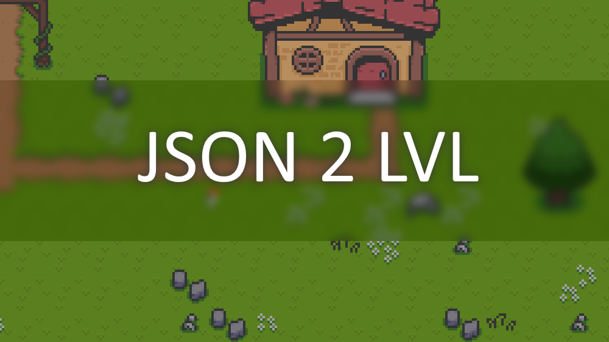

# JSON2LVL
This tool converts a Tiled JSON file to a compressed binary file.



## How do I use it?
First in Tiled you need to export your tile map as a JSON file. Next just drag and drop the JSON file onto the executable and it will take care of the rest. The exported file should be at the same location as the file you want to be converted. It may take a bit to process larger files since compressig them takes some time. I do plan on allowing you to change the compression level or disable it completely in the future.

## How do I load it?
Here's an example of how to load it into a UInt16 array:
```CSharp
//Here is the data, you could make it a 3d array if you would like, this example just puts everythig into one array
UInt16[] data;

//Creates the steams and reader
FileStream fs = File.OpenRead(RESOURCE_PATH_HERE);//Put the path to your resource here
GZipStream gs = new GZipStream(fs, CompressionLevel.Optimal);
BinaryReader br = new BinaryReader(gs);

//Reads the file header
Width = br.ReadUInt32();
Height = br.ReadUInt32();
LayerCount = br.ReadUInt32();

data = new UInt16[Width * Height * LayerCount];

//Reads all of the data
for(int i = 0; i < _data.Length; i++)
{
    data[i] = br.ReadUInt16();
}

//Don't forget to close the streams and reader!
br.Close();
gs.Close();
fs.Close();
```

## What is the files structure?
* The first 4 bytes are an unsigned int for the width of the map.
* The second 4 bytes are an unsigned int for the height of the map.
* The third 4 bytes are an unsigned int for the layer count of the map.
* Anything after that is all the tile IDs represented as a single array of unsigned shorts.

The name of the map should be the filename so it is not stored.
You should be able to have an infinite amount of layers for a single map with each layer being the size of the width * height.
It also compresses the file with GZip which should make it much smaller at the expense of longer loading times.

## Note:
* Due to it using unsigned shorts, 0 is considered an empty tile. So when referencing a tile sheet you need to subtract 1 to get the correct index.
* There can only be one tileset per map but I do plan on adding the ability to use more.
